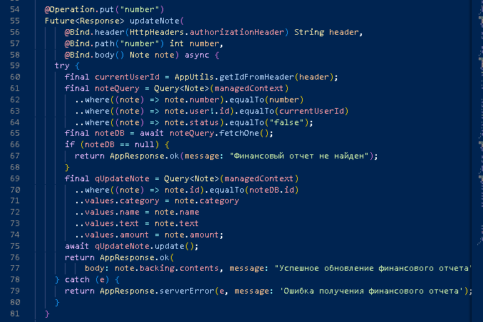

# Практическая работа 6
### Тема работы: Создание API при помощи пакета Conduit
#### Цель работы: создать API  включающий в себя регистрацию, авторизацию, RefreshToken, вывод данных пользователя, редактирование данных пользователя, изменение пароля пользователя,  CRUD действия по теме, поиск, пагинацию данных, фильтрацию, логическое удаление и восстановление, историю действий.

#### Ход работы: 

##### Код регистрация

##### Пример работы:

##### Код авторизация

##### Пример работы:

##### Код RefreshToken

##### Пример работы:

##### Код вывода данных пользователя

##### Пример работы:

##### Код редактирования данных пользователя

##### Пример работы

##### Код изменения пароля

##### Пример работы

##### Код создания отчета 

##### Пример работы

##### Код изменения отчета

##### Пример работы

##### Код вывода отчетов

##### Пример работы вывода заметок c пагинацией 

##### Пример вывода заметок с фильтром

##### Код для логического удаления отчета

##### Пример работы 

##### Код восстановления отчета

##### Пример работы

#### Вывод: создал API включающий в себя регистрацию, авторизацию, RefreshToken, вывод и редактирование данных пользователя, изменение пароля пользователя, пагинацию данных, фильтрацию, логическое удаление и восстановление, историю действий.
